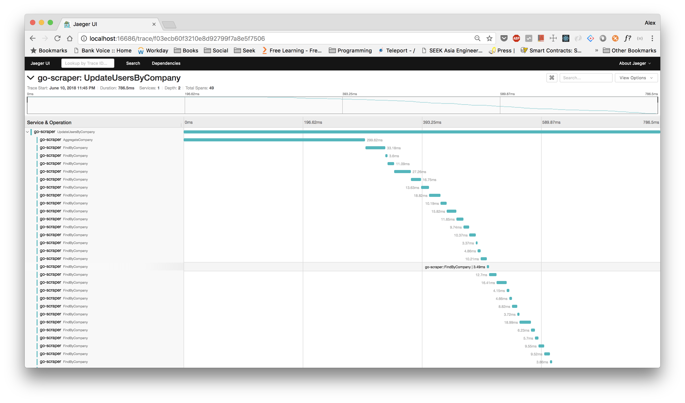
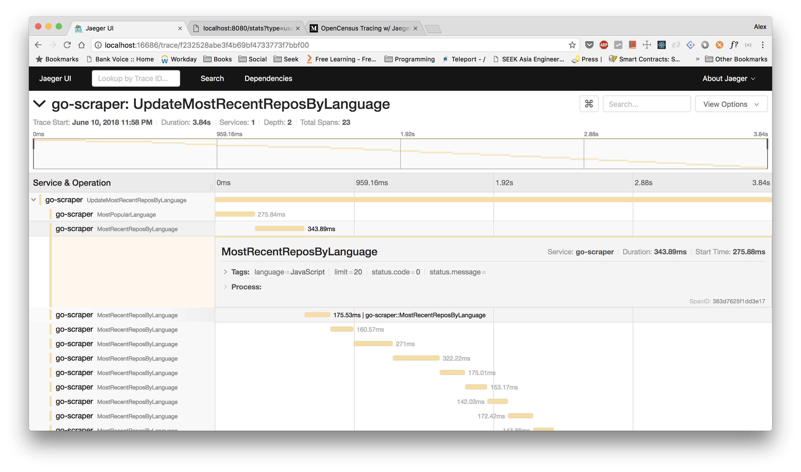

# go-github-scraper

A Github Scraper and recommendation engine written in `Go`, to replace the previous version written in NodeJS (TypeScript).


## Development

Create a `.env` that contains minimum the following environment variables:

```.env
GITHUB_TOKEN=<your_github_token>
DB_NAME=<mgo_db_name>
DB_HOST=<mgo_db_host>
DB_USER=<mgo_db_user>
DB_AUTH=<mgo_db_auth>
DB_PASS=<mgo_db_pass>
```

## Start

```bash
$ make start
```

## Build Docker Image

```bash
$ make docker
```


## Tracing

Using __opencensus__ to add __jaeger__ tracing capabilities:




Additional metadata (key-value pairs) can be added for more information:

